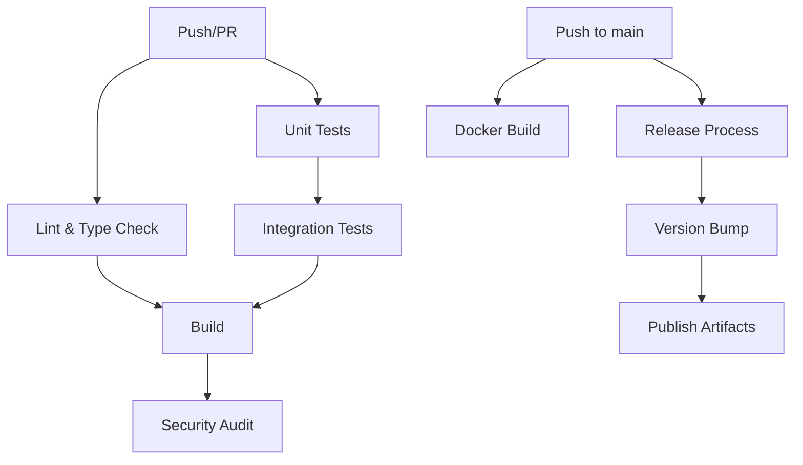

# CI/CD Workflows Documentation

This directory contains GitHub Actions workflows that automate testing, building, and deployment processes for the Tailscale MCP Server.

## Overview

The project uses a comprehensive CI/CD pipeline with three main workflows:

- **[CI Workflow](#ci-workflow)** (`ci.yml`) - Continuous integration with testing and quality checks
- **[Docker Workflow](#docker-workflow)** (`docker.yml`) - Container image building and publishing
- **[Release Workflow](#release-workflow)** (`release.yml`) - Automated releases and version management

## CI Workflow

**File**: `ci.yml`
**Triggers**: Push to `main`/`develop`, Pull requests to `main`/`develop`

### Jobs Overview

#### 1. Lint and Type Check

- **Purpose**: Code quality validation
- **Node.js**: 20
- **Steps**:
  - TypeScript type checking (`npm run typecheck`)
  - Code linting (when configured)

#### 2. Unit Tests

- **Purpose**: Fast, isolated component testing
- **Node.js Matrix**: 18, 20, 22
- **Features**:
  - Cross-platform compatibility testing
  - Coverage reporting to Codecov
  - No external dependencies required

#### 3. Integration Tests

- **Purpose**: End-to-end testing with Tailscale CLI
- **Node.js**: 20
- **Requirements**:
  - Tailscale CLI installation
  - Optional: Tailscale authentication for full testing
- **Features**:
  - CLI security validation
  - Real Tailscale integration (when authenticated)
  - Graceful degradation without auth
  - Automatic cleanup

#### 4. Build Verification

- **Purpose**: Ensure project builds correctly
- **Artifacts**: Uploads build output for verification
- **Validation**: Checks for required output files

#### 5. Security Audit

- **Purpose**: Dependency vulnerability scanning
- **Tools**:
  - `npm audit` (moderate level)
  - `audit-ci` for CI-specific checks

### Environment Variables

| Variable              | Purpose                  | Required |
| --------------------- | ------------------------ | -------- |
| `TAILSCALE_AUTH_KEY`  | Full integration testing | Optional |
| `TAILSCALE_TEST_MODE` | CI test mode flag        | Auto-set |

### Coverage Reporting

- **Unit Tests**: Uploaded to Codecov with `unittests` flag
- **Integration Tests**: Uploaded to Codecov with `integration` flag
- **Threshold**: Configurable per test type

## Docker Workflow

**File**: `docker.yml`
**Triggers**: Push to `main`, version tags (`v*`), manual dispatch

### Features

#### Multi-Platform Builds

- **Platforms**: `linux/amd64`, `linux/arm64`
- **Registry**: GitHub Container Registry (GHCR)
- **Caching**: GitHub Actions cache for faster builds

#### Image Tagging Strategy

- **Branch**: `main` → `latest`
- **Tags**: `v1.2.3` → `1.2.3`, `1.2`, `1`
- **SHA**: Commit-specific tags for traceability
- **PR**: Preview tags for pull requests

#### Security Scanning

- **Tool**: Trivy vulnerability scanner
- **Integration**: Results uploaded to GitHub Security tab
- **Format**: SARIF for GitHub integration

### Registry Configuration

```bash
# Define registry and image name
REGISTRY=ghcr.io/hexsleeves
IMAGE_NAME=tailscale-mcp-server

# Login to GitHub Container Registry
docker login $REGISTRY -u USERNAME -p GITHUB_TOKEN

# Pull images
docker pull ${{ REGISTRY }}/${{ IMAGE_NAME }}:latest
```

## Release Workflow

**File**: `release.yml`
**Triggers**: Push to `main`, manual dispatch with release type

### Automated Version Bumping

#### Commit-Based Detection

- **Major**: `BREAKING CHANGE` or `!:` in commit message
- **Minor**: `feat:` prefix in commit message
- **Patch**: All other commits

#### Manual Override

- **Workflow Dispatch**: Choose `patch`, `minor`, `major`, or `prerelease`
- **Interactive**: Use local publish script for full control

### Release Process

1. **Quality Gates**

   - Full test suite execution
   - Build verification
   - Artifact validation

2. **Version Management**

   - Automatic `package.json` version bump
   - Git tag creation (`v1.2.3`)
   - Changelog generation from commits

3. **Artifact Publishing**
   - Build artifacts uploaded
   - NPM package publishing (when configured)
   - Docker images via Docker workflow

### Release Types

| Type         | Description                       | Example                   |
| ------------ | --------------------------------- | ------------------------- |
| `patch`      | Bug fixes, minor updates          | `1.0.0` → `1.0.1`         |
| `minor`      | New features, backward compatible | `1.0.0` → `1.1.0`         |
| `major`      | Breaking changes                  | `1.0.0` → `2.0.0`         |
| `prerelease` | Alpha/beta versions               | `1.0.0` → `1.0.1-alpha.0` |

## Workflow Dependencies



## Configuration Files

### Jest Configurations

- `jest.config.ts` - Base configuration
- `jest.config.unit.ts` - Unit test specific
- `jest.config.integration.ts` - Integration test specific

### TypeScript

- `tsconfig.json` - TypeScript compiler configuration
- Type checking in CI ensures code quality

### ESLint

- `eslint.config.js` - Code linting rules
- Integrated into CI pipeline

## Secrets and Variables

### Repository Secrets

| Secret               | Purpose               | Required     |
| -------------------- | --------------------- | ------------ |
| `TAILSCALE_AUTH_KEY` | Integration testing   | Optional     |
| `NPM_TOKEN`          | NPM publishing        | For releases |
| `DOCKER_HUB_TOKEN`   | Docker Hub publishing | For releases |

### Environment Variables

| Variable       | Purpose                 | Default                    |
| -------------- | ----------------------- | -------------------------- |
| `NODE_VERSION` | Primary Node.js version | `"20"`                     |
| `REGISTRY`     | Container registry      | `ghcr.io`                  |
| `IMAGE_NAME`   | Container image name    | `${{ github.repository }}` |

## Troubleshooting

### Common Issues

#### Integration Tests Failing

```bash
# Check Tailscale CLI installation
tailscale version

# Verify authentication (if using auth key)
tailscale status
```

#### Docker Build Issues

```bash
# Check multi-platform support
docker buildx ls

# Verify registry authentication
docker login ghcr.io
```

#### Release Process Issues

```bash
# Check version format
npm version --help

# Verify Git configuration
git config user.name
git config user.email
```

### Debug Mode

Enable debug logging in workflows:

```yaml
- name: Debug Step
  run: echo "Debug information"
  env:
    ACTIONS_STEP_DEBUG: true
```

## Best Practices

### Workflow Maintenance

1. **Regular Updates**: Keep action versions current
2. **Security**: Use pinned action versions for security
3. **Caching**: Leverage GitHub Actions cache for dependencies
4. **Secrets**: Rotate secrets regularly

### Testing Strategy

1. **Fast Feedback**: Unit tests run on multiple Node.js versions
2. **Real Integration**: Integration tests with actual Tailscale CLI
3. **Security First**: Regular dependency audits
4. **Coverage**: Maintain high test coverage

### Release Management

1. **Semantic Versioning**: Follow semver principles
2. **Changelog**: Auto-generate from commit messages
3. **Rollback**: Tag-based rollback capability
4. **Verification**: Always verify builds before release

## Contributing to Workflows

### Adding New Workflows

1. Create workflow file in `.github/workflows/`
2. Follow existing naming conventions
3. Add appropriate triggers and permissions
4. Include error handling and cleanup
5. Update this documentation

### Modifying Existing Workflows

1. Test changes in feature branches
2. Consider backward compatibility
3. Update documentation
4. Verify all dependent workflows

For more information about GitHub Actions, see the [official documentation](https://docs.github.com/en/actions).
